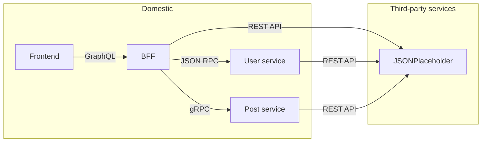
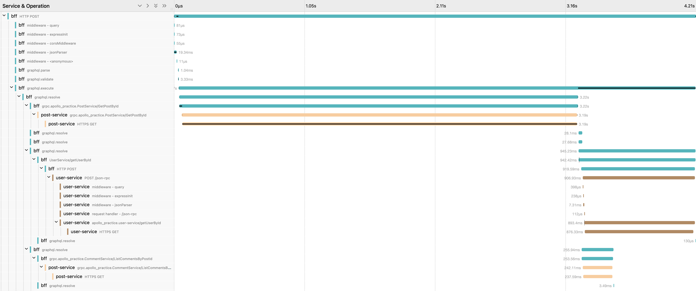

# Apollo practice

This repo is a practice of using Apollo Server as a BFF that aggregates various backend services.

## Practices

- GraphQL -> TypeScript codegen (both client and server)
- Data sources (REST, gRPC, JSON RPC)
- JWT-based authentication
- Logging
- Plugins
- Tracing

## Architecture



## Logging

Logging is done with Winston in a whitelist manner (implemented as a custom format).
Only registered messages are logged.

```ts
import { logger, messages } from "./logging";

logger.info(messages.info.serverStarted(url)); // info: Server started at http://localhost:4000

logger.info("Server started"); // info: Unregistered "info" level message
```

## Tracing

Tracing is reported in OpenTelemetry format to a local Jaeger instance.

Components with tracing include:

- BFF (incoming GraphQL requests, outgoing JSON RPC calls, outgoing gRPC calls)
- User service (incoming JSON RPC calls, outgoing REST API calls)
- Post service (incoming JSON RPC calls, outgoing REST API calls)

An example trace:



## TODO

- [ ] Authentication & authorization
- [ ] Figure out whether `ID` could be a number
