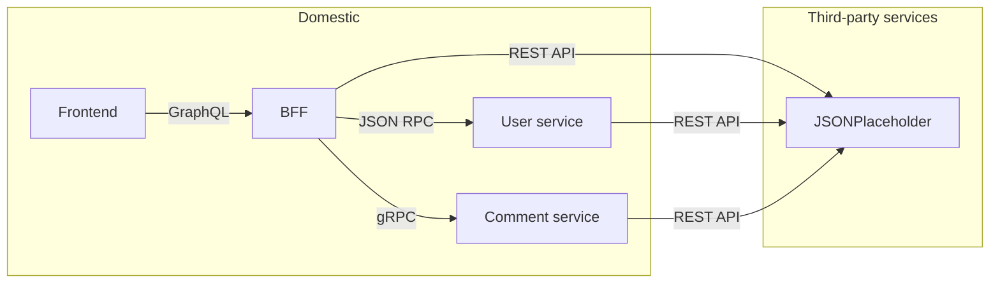

# Apollo practice

This repo is a practice of using Apollo Server as a BFF that aggregates various backend services.

## Practices

- GraphQL -> TypeScript codegen (both client and server)
- Data sources (REST, gRPC, JSON RPC)
- Logging
- Plugins
- Tracing

## Architecture

